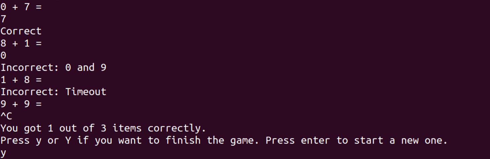
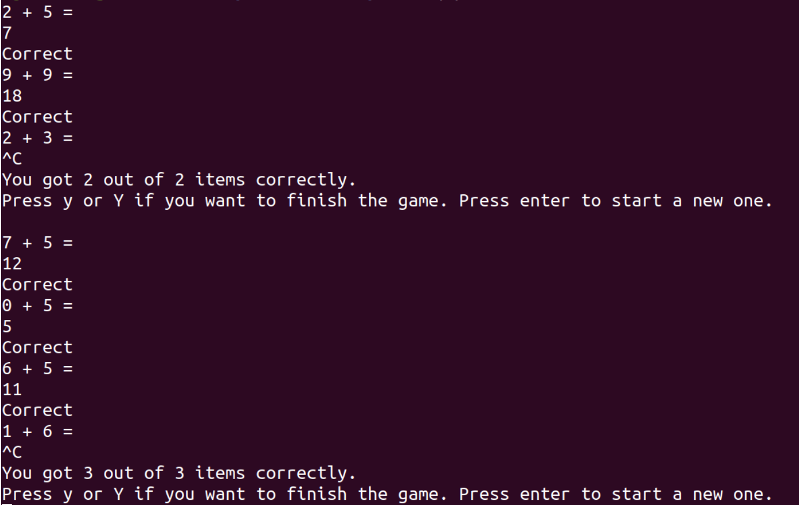

# Linux Addition Game

### Program Specifications:
A game that randomly generates two single digit numbers and asks the user to input the sum of the two numbers. The user only has 3 seconds to answer otherwise, it will be marked incorrectly. If the user interrupts the process, e.g. presses CTRL + C, then the program should display the score of the user and ask if they user really wants to end the game or start a new one.

Once the user starts the program, it will generate two single digit numbers at a time randomly. If the user correctly inputs the sum, then it will output correct, otherwise, it will output the user input and the correct answer. If the user takes too long to answer, then the question should timeout and the user will be marked incorrect.

If the user interrupts program, then the process should output the score of the user and prompt whether it wants to exit the process or start a new game. If the user chooses to start a new game, then the score should reset back to zero.

The user should only press y or Y without the ENTER key to exit the game. If the user presses any key other than y or Y or ENTER, the program will not do anything and keep on getting input from the user until it inputs either of the three.

### License

This project is licensed under the MIT License - see the [LICENSE.md](LICENSE.md) file for details

### Author

* Joie Angelo Llantero
